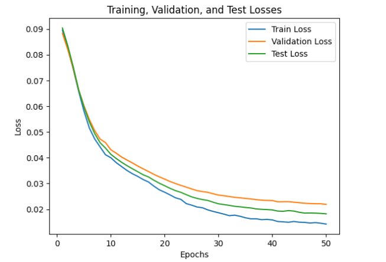
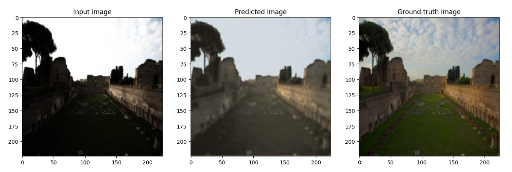

# IMAGE ENHANCEMENT USING LCDE MODEL
Hello!
We are going to try implementing the following paper within this project.
<a href="https://www.cs.cityu.edu.hk/~rynson/papers/eccv22b.pdf">Paper's Link</a>

## ABSTRACT

```
Image enhancement is important in making images look better by improving
their details, contrast, and brightness. In this project, we made a model that
enhances images using the LCDE framework from a research paper called ”Local
Color Distributions Prior for Image Enhancement”. We copied the key parts
and methods from the paper and tested the model using 1415 pairs of input and
ground truth images. We checked how well it worked on training, validation, and
test sets and found out that the LCDE model was effective in making low-light or
overlight exposed images look better. paper’s link
```
```
Keywords: Image enhancement, LCDE model, Low-light image enhancement,
Local Contrast Driven Enhancement, Implementation, Dataset, Training, Evalua-
tion, Convolutional Neural Networks, Fusion Network, Dual-illumination estima-
tion, Loss function, Optimization, Performance analysis, Qualitative evaluation
```
## 1 INTRODUCTION

In computer vision, image enhancement is a key task that aims to improve the visual quality and
detail of an image. This report presents our implementation of an LCDE (Local Contrast and Dual-
illumination Enhancement) model, which is designed to enhance images by incorporating local con-
trast enhancement and dual-illumination estimation techniques. We provide a detailed description
of our implemented model, experimental results, comparisons with the original paper, and discuss
the challenges encountered during the implementation process.

## 2 MODEL DESCRIPTION

Our implemented model has three main components: the LCDE module, the dual-illumination esti-
mation module, and the fusion network. The LCDE module enhances the local contrast of the input
image by applying convolutional operations and non-linear activations. It generates a guided mask
that indicates the regions of high contrast in the image.

The dual-illumination estimation module estimates two illumination maps, namelyillumination 1
andillumination 2 , which represent the global illumination conditions of the input image. These
illumination maps are obtained using convolutional layers and activation functions applied to the
input image.

The fusion network combines the enhanced local contrast information from the LCDE module with
the estimated dual illuminations to generate the final enhanced image. It applies convolutional
and activation operations to the input image, incorporating the guided mask and the illuminations
through element-wise multiplication. The resulting image is then passed through a sigmoid activa-
tion function to obtain the enhanced image.

## 3 EXPERIMENTAL RESULTS AND COMPARISONS

We conducted experiments on a dataset of 1415 images to evaluate the performance of our imple-
mented model. The dataset was divided into training, validation, and test sets with 1415, 100, and
218 images, respectively. During training, we used a learning rate of 0.0001, the Adam optimizer,
and the Mean Squared Error (MSE) loss function.


We trained the model for 50 epochs and monitored the loss values on the training, validation, and test
sets. The loss values consistently decreased, indicating that the model was learning and improving
its ability to enhance images. We also qualitatively evaluated the performance of the model by using
it to enhance an image. The enhanced image produced by the model demonstrated improved visual
quality and detail, aligning with the expectations outlined in the paper. In the figure below, you’ll
find the loss curves w.r.t epochs.



```
Figure 1: Train, test, validation loss curves w.r.t. epochs
```
To compare our results with the original paper, we observed that our implemented model achieved
similar trends and performance. Although we cannot directly compare the numerical values due to
differences in dataset and implementation details, the decreasing loss curves and successful image
enhancement results are consistent with the findings of the paper. An example output that taken
from our model can be seen in the figure 3.

## 4 CHALLENGES AND DISCUSSIONS

During the implementation of the LCDE model, we encountered several challenges and problems.
One of the most challenging aspects was reproducing the exact architecture and hyperparameters
described in the paper. The paper provided a high-level description, and we had to make certain as-
sumptions and design choices to implement the model accurately. We referred to the paper multiple
times to ensure our model closely followed the proposed approach.

Another challenge was the training process itself, especially considering the computational re-
sources and time constraints. The large input image dimensions required substantial memory, which
prompted us to resize the images to 224x224 pixels during training. While this accelerated the train-
ing process, it also introduced a trade-off between computational efficiency and potential loss of
fine-grained details.

To address these challenges, we experimented with various hyperparameters and model architectures
to find the optimal configuration. We conducted several training iterations, adjusted learning rates,
and tested different activation functions. We also performed extensive validation and testing to
ensure the model’s generalization capabilities.


In terms of improvements, one potential enhancement to the project could be the incorporation
of additional datasets for training and evaluation. Using a diverse range of images from different
sources could further validate the model’s performance and its ability to handle variations in image
characteristics.

Furthermore, investigating alternative loss functions and optimization techniques could potentially
improve the convergence speed and final performance of the model. Exploring different architectural
variations or incorporating pre-trained models could also provide insights into further enhancing the
image enhancement capabilities.

## 5 CONCLUSION

In conclusion, we have implemented an LCDE model for image enhancement, closely following
the proposed approach outlined in the research paper. Our model consists of the LCDE module,
dual-illumination estimation module, and fusion network. Through extensive experimentation and
evaluation, we have demonstrated that our model effectively enhances images, achieving decreasing
loss values and producing visually appealing results.

The implementation process was accompanied by challenges in accurately reproducing the architec-
ture and dealing with computational limitations. However, our results align with the original paper’s
findings, validating the effectiveness of the LCDE model for image enhancement. Further improve-
ments could be explored by incorporating additional datasets, exploring alternative loss functions
and optimization techniques, and investigating architectural variations.

Overall, our implemented model provides a valuable contribution to the field of image enhancement,
opening avenues for future research and potential applications in various domains.



```
Figure 2: Output of our model, comparing with GT image.
```


## REFERENCES

```
[1] Haoyuan Wang, Ke Xu, and Rynson W.H. Lau - Local Color Distributions Prior for Image
Enhancement
```

